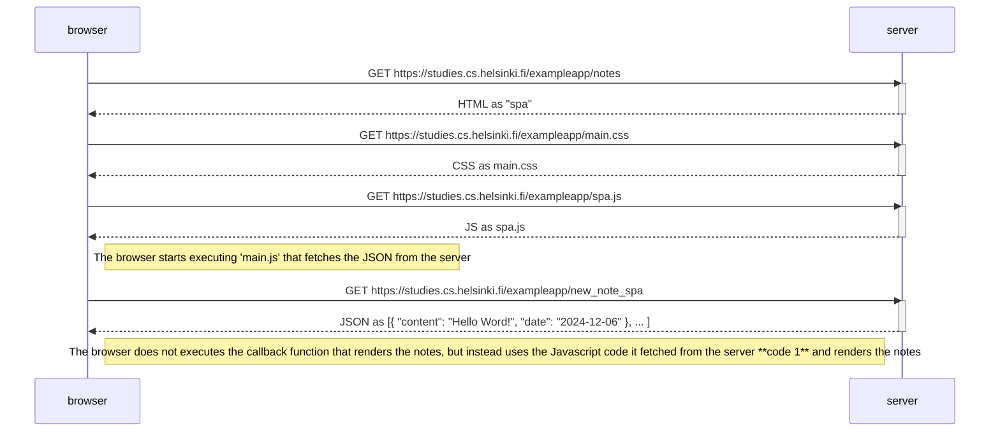

Code 1:
```js
const form = document.getElementById('notes_form')
form.onsubmit = function(e) {
  e.preventDefault()

  const note = {
    content: e.target.elements[0].value,
    date: new Date(),
  }

  notes.push(note)
  e.target.elements[0].value = ''
  redrawNotes()
  sendToServer(note)
}